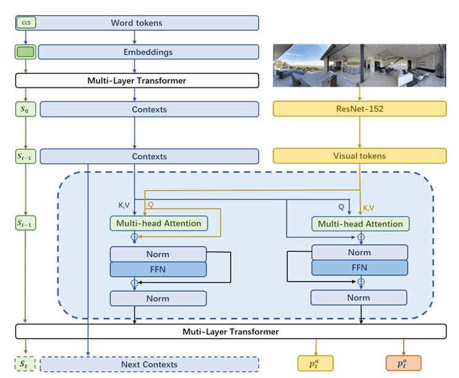
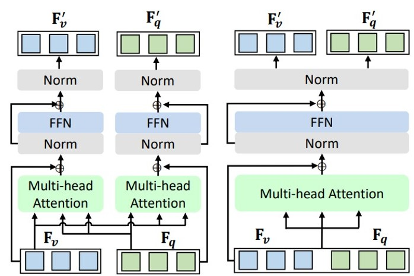
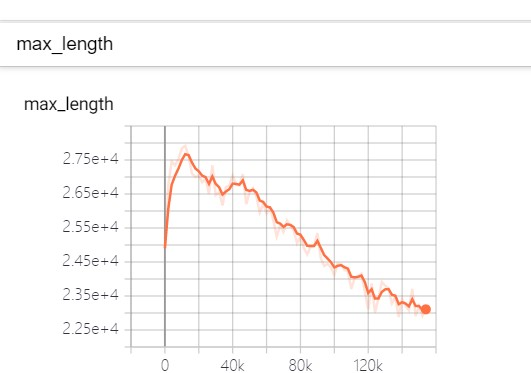
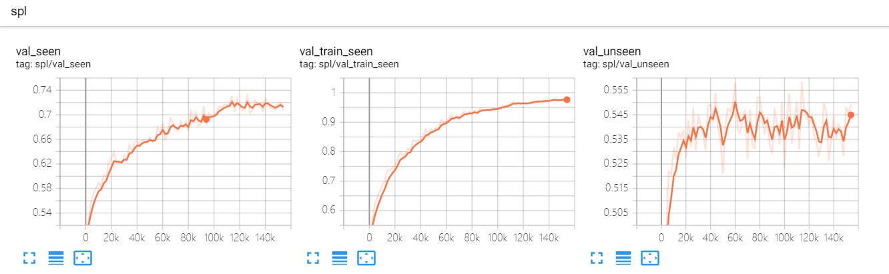
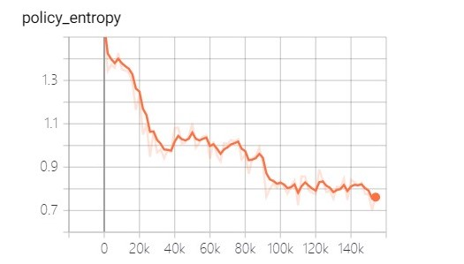
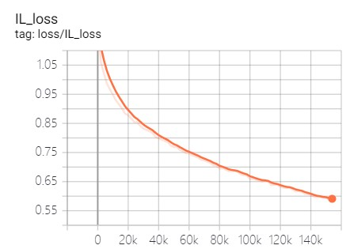
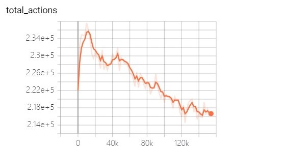
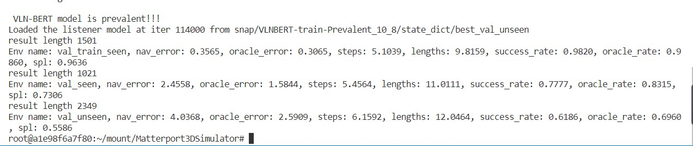

# 基于视觉-语言理解的智能室内机器人导航系统

<p align="center">  </p>

​	随着社会的发展，室内建筑逐渐呈现复杂化和多样化的趋势，导致传统的机器人导航难以感知室内丰富的视觉信息，无法制定精准化的导航策略。为解决上述问题，本项目拟构建一个基于视觉-语言理解的智能室内机器人导航系统，通过机器感知室内环境信息实现智能导航。该系统着重解决传统导航以关键词检索相关位置而忽略视觉上的丰富语义信息的问题，能够实现更为细粒度化的文本视觉->位置实现建模，使机器人真正听懂用户需求，制定精准化的导航策略。该项目有利于丰富我校人工智能的多样化发展，同时也具有较高的科研价值与商业价值。

​	本项目致力于打造一款高效的基于视觉-语言理解的智能室内机器人导航系统。通过使用先进的神经网络模型，来对语言信息、视觉信息、空间信息等进行建模。通过视觉传感器、移动机器人等设备进行实现。最终打造一款对文本-视觉信息处理更加细粒的智能室内导航系统。

   本项目基于VLN-BERT模型。该模型使用的时间感知循环 BERT 模型极大地提升了视觉语言导航（Vision-Language Navigation， VLN）的性能，取得了VLN任务的SOTA，是Transformer在机器人导航领域的一个典型应用。具体来说，该系统为 BERT 模型配备了一个循环函数。该函数能够为系统维护跨模式状态信息。通过在 R2R 和 REVERIE数据集进行的实验，证明了该模型可以替换更复杂的encoder-decoder模型，以实现最先进的结果。


### 模型效果

<table border="2">
    <thead>
        <tr>
            <th colspan=1> 模型</th>
            <th colspan=1> 会议</th>
            <th colspan=4> &nbsp&nbsp&nbsp&nbsp&nbsp&nbsp&nbsp R2R Seen </th>
            <th colspan=4> &nbsp&nbsp&nbsp&nbsp&nbsp&nbsp&nbsp R2R Unseen</th>
        </tr>
    </thead>
    <tbody>
    <tr>    
            <td><b>名称 </b></td>
            <td><b>名称</b></td>
            <td>TL</td>
            <td>NE</td>
            <td>SR</td>
            <td>SPL</td>
            <td>TL</td>
            <td>NE</td>
            <td>SR</td>
            <td>SPL</td>
        </tr>
    </tbody>
   <tbody>
<tr>    
        <td>PREVALENT </td>
        <td>CVPR2020</td>
        <td>10.32</td>
        <td>3.67</td>
        <td>69</td>
        <td>65</td>
        <td>10.19</td>
        <td>4.71</td>
        <td>58</td>
        <td>53</td>
    </tr>
</tbody>
<tbody>
<tr>
        <td>VLNBert</td>
        <td>CVPR2021</td>
        <td>11.13 </td>
        <td>2.90 </td>
        <td>72</td>
        <td>68</td>
        <td>12.01</td>
        <td>3.93</td>
        <td>63</td>
        <td>57</td>
    </tr>
</tbody>
<tbody>
<tr>
        <td>HAMT</td>
        <td>NeurIPS2021</td>
        <td>11.15</td>
        <td>2.51</td>
        <td> 76 </td>
        <td> <font color="#FF0000"><b>72</b></font> </td>
        <td> 11.46</td>
        <td> <font color="#FF0000"><b>2.29</b></font> </td>
        <td>66</td>
        <td><font color="#FF0000"><b>61</b></font></td>
    </tr>
</tbody>
<tbody>
<tr>
        <td>DUET</td>
        <td>CVPR 2022 </td>
        <td>/</td>
        <td>/</td>
        <td>/</td>
        <td>/</td>
        <td><font color="#FF0000"><b> 13.94</b></font>  </td>
        <td> 3.31</td>
        <td><font color="#FF0000"><b>72</b></font></td>
        <td>60</td>
    </tr>
</tbody>
<tbody>
<tr>
        <td><b>Ours</b></td>
        <td> </td>
        <td>11.01</td>
        <td><font color="#FF0000"><b>2.45</b></font></td>
        <td><font color="#FF0000"><b>77</b></font></td>
        <td>69</td>
        <td> 12.04  </td>
        <td> 4.03</td>
        <td>61</td>
        <td>55</td>
    </tr>
</tbody>
</table>


本项目在 Room-To-Room 数据集上面已经达到了较为理想的效果。该数据集主要有四个评估指标，TL、NE、SR、SPL。如表所示在本项目之中，我们的模型在 Room-To-Room 数据集 seen 部分上具有着较好的性能，在 NE 和 SR 两个指标之中超过了大部分的 VLN 模型。在 Room-To-Room 数据集 unseen 部分我们的模型数据也同样到达了总体 VLN 模型中的中上游水准。总体看来，我们提出的算法已经有能力进行一些实地场景的测试与实验。

> TL（Trajectory Length）：模拟器导航的平均路径长度。
>
> NE  (Navigation Error)：模型最终位置与真实目标的平均距离，以米为单位。
>
> SR (Success Rate)：模型在目标 3 米内停止，是做成功到达。代表成功到达的比率。
>
> SPL (Success  weighted by the normalized inverse of the Path Length)：成功到达中的目标路径长 度。


### 关键创新

​	在进行模型的构建与实验中，我们发现视觉信息和语言信息这两种不同模态的信息具 有较大的区别。对于图片特征而言，其中的信息主要有具体的实物决定。所以图片特征一 般都遵循着一定的空间结构。而语言特征则一般遵循着特定的语法结构，每一个单词都遵 循这特定的语义信息。我们认为，由于这两种不同特征的特有结构的不同，所以需要更加 深入的模态融合的过程。之前的工作主流的模态融合的方法是将不同模态的特征映射到相 同的向量空间之中，然后使用注意力机制对不同模态的上下文关系进行建模。但是，我们 认为这种方法欠缺对不同模态信息更加充分的融合。 

​	所以在本项目之中，我们选择使用协同注意力机制（co-attention）来实现多模态特征更 加充分的融合。之前的自注意力机制使用相同模态的特征同时输入作为 Q、K、V，来对其 进行模态内的上下文关系的建模。协同注意力机制（co-attention）将某一模态的特征作 为 Q，而另一模态的特征作为 K、V。这种方法可以实现不同模态的特征的充分的融合。具 体做法为现将两个模态的特征向量映射到相同的空间之中，然后输入协同注意力机制实现 多模态特征更加充分的融合。其次对于融合之后的特征在输入注意力机制之中进行跨模态 交互。最终得到下一时刻的状态与输出动作概率和对象概率


<p align="center">  </p>


### 训练可视化

​	我们分别对数据集训练的路径最大长度（图 4）、spl 指标（图 5）、loss（图 6）以 及决策数量（图 7）进行了可视化。

- 最大长度可视化

  

  <p align="center">  </p>

  

- spl 指标可视化

  

  <p align="center">  </p>

  

- loss可视化

<p align="center">  </p>


- 决策数量可视化

  <p align="center">  </p>

  

### 训练实测

- GPU：NVIDIA 2080Ti GPU 
- Learning Rate：1e-5
- Optimizer： AdamW 优化器
- Batch size : 16
- Epoch: 300,000 。

**注：**对于虚拟数据集 R2R 而言，我们分别在原 始数据和通过 PREVALENT 数据增强方法来进行训练。对于预训练而言，我们选择使用由 Places365 上 预训练的 ResNet-152 权重来进行实验。一次训练完整的训练时间为六天左右。

<p align="center">  </p>


## 具体设置

具体设置需要安装[Matterport3D 模拟器](https://github.com/peteanderson80/Matterport3DSimulator) 和 [Pytorch-Transformers](https://github.com/huggingface/transformers) 才可以进行运行。

我们的设置与我们的**baseline** [Recurrent-VLN-BERT]([YicongHong/Recurrent-VLN-BERT: Code of the CVPR 2021 Oral paper: A Recurrent Vision-and-Language BERT for Navigation (github.com)](https://github.com/YicongHong/Recurrent-VLN-BERT))相同

但是这之前的安装代码会出现很多小bug，尤其是在python2和python3的代码进行转换是有很多问题。我们可以参照这位大哥的博文进行安装[Matterport3D搭建与VLNBERT实现](https://zhuanlan.zhihu.com/p/424693141)

### 数据准备

- MP3D navigability graphs: `connectivity`
  - 下载 [connectivity maps [23.8MB]](https://github.com/peteanderson80/Matterport3DSimulator/tree/master/connectivity).
- R2R data: `data`
  - 下载 [R2R data [5.8MB]](https://github.com/peteanderson80/Matterport3DSimulator/tree/master/tasks/R2R/data).
- 数据增强: `data/prevalent`
  - 下载 [collected triplets in PREVALENT [1.5GB]](https://zenodo.org/record/4437864/files/prevalent_aug.json?download=1) (pre-processed for easy use).
- MP3D image features: `img_features`
  - 下载 [Scene features [4.2GB]](https://www.dropbox.com/s/85tpa6tc3enl5ud/ResNet-152-places365.zip?dl=1) (ResNet-152-Places365).

### 初始化 OSCAR 和 PREVALENT 权重

- 预训练权重 [PREVALENT](https://github.com/weituo12321/PREVALENT) 
  - 下载 `pytorch_model.bin` 请从 [这里](https://drive.google.com/drive/folders/1sW2xVaSaciZiQ7ViKzm_KbrLD_XvOq5y).

### 训练网络权重

- Recurrent-VLN-BERT: `snap`
  - 下载具体网络实验结果请联系邮箱：jiaxiuli@mail.hfut.edn.cn

### 测试结果

运行代码

```bash
bash run/test_agent.bash
```

### 实验训练

运行代码

```bash
bash run/train_agent.bash
```

训练权重会保存在 `snap/`目录下


